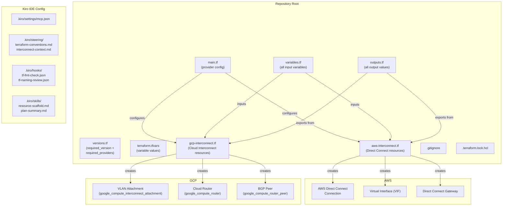

# Design Document

## Overview

This design describes the technical implementation of the `terraform-aws-interconnect-demo-setup` feature: a flat Terraform project at the repository root that provisions an AWS Direct Connect ↔ GCP Cloud Interconnect demo environment, alongside Kiro IDE configuration (MCP servers, steering files, hooks, and skills) that automates quality checks and provides domain context to the Kiro agent.

**Key design decisions:**

- **Flat layout** — all `.tf` files live at the repository root. No `modules/` or `environments/` subdirectories. This minimises path complexity for a single-environment demo.
- **Per-cloud files** — AWS resources go in `aws-interconnect.tf`, GCP resources in `gcp-interconnect.tf`. This separates concerns while staying flat.
- **Local Terraform state** — no `backend.tf`; state is stored locally using Terraform's default local backend. Suitable for a single-developer demo.
- **Kiro-first developer experience** — hooks run `terraform fmt -check` and an agent naming-convention review on every `.tf` save; skills scaffold new resource files and summarise plan output on demand.
- **PBT not applicable** — the entire feature consists of declarative HCL configuration and IDE configuration files. There are no pure functions suitable for property-based testing. Testing relies on Terraform validation blocks (built-in), schema validation (JSON/YAML linting), and smoke tests against a real or mocked Terraform environment.

---

## Architecture



---

## Components and Interfaces

### 1. Terraform Root Files

#### `versions.tf`

Declares minimum version constraints to ensure reproducibility:

```hcl
terraform {
  required_version = ">= 1.5.0"
  required_providers {
    aws = {
      source  = "hashicorp/aws"
      version = "~> 5.0"
    }
    google = {
      source  = "hashicorp/google"
      version = "~> 5.0"
    }
  }
}
```

#### `main.tf`

Provider configuration for both clouds:

```hcl
provider "aws" {
  region = var.aws_region
}

provider "google" {
  project = var.gcp_project_id
  region  = var.gcp_region
}
```

#### `variables.tf`

Declares **all** input variables for the project. Variables are grouped with comments by domain (AWS Direct Connect, GCP Interconnect). Validation blocks are embedded inline on constrained variables.

AWS variables: `aws_region`, `connection_bandwidth` (validated against `1Gbps/10Gbps/100Gbps`), `vlan_id` (validated 1–4094), `bgp_asn`, `bgp_auth_key` (sensitive).

GCP variables: `gcp_project_id` (validated against `^[a-z][a-z0-9\-]{4,28}[a-z0-9]$`), `gcp_region`, `interconnect_type` (validated `PARTNER`/`DEDICATED`), `vlan_tag` (validated 1–4094), `gcp_bgp_asn` (validated 1–4294967295), `advertised_route_priority` (validated 0–65535).

#### `outputs.tf`

All output values for both clouds. AWS outputs: `connection_id`, `virtual_interface_id`, `gateway_id`. GCP outputs: `vlan_attachment_name`, `cloud_router_id`, `bgp_peer_ip`.

#### `terraform.tfvars`

Supplies values for every variable. Every placeholder value is annotated with `# REPLACE`:

```hcl
aws_region            = "us-east-1"          # REPLACE
connection_bandwidth  = "1Gbps"              # REPLACE
vlan_id               = 100                  # REPLACE
bgp_asn               = 64512               # REPLACE
bgp_auth_key          = "REPLACE_ME"         # REPLACE — sensitive

gcp_project_id             = "my-project-id"     # REPLACE
gcp_region                 = "us-central1"        # REPLACE
interconnect_type          = "DEDICATED"           # REPLACE
vlan_tag                   = 100                  # REPLACE
gcp_bgp_asn                = 16550                # REPLACE
advertised_route_priority  = 100                  # REPLACE
```

#### `.gitignore`

```
*.tfstate
*.tfstate.backup
.terraform/
*.tfvars.local
*.auto.tfvars
```

#### `.terraform.lock.hcl`

An empty (but syntactically valid HCL) placeholder is committed so the file is tracked in version control from project creation. Developers populate it by running `terraform init`.

---

### 2. AWS Direct Connect Resources (`aws-interconnect.tf`)

Three resources are declared:

| Resource | Terraform type | Purpose |
|---|---|---|
| Direct Connect Connection | `aws_dx_connection` | Physical connection to AWS backbone |
| Direct Connect Gateway | `aws_dx_gateway` | Routes traffic to one or more VGWs/TGWs |
| Private Virtual Interface | `aws_dx_private_virtual_interface` | Associates the connection with the gateway via BGP |

The connection resource references `var.connection_bandwidth` and `var.aws_region`. The VIF references `var.vlan_id`, `var.bgp_asn`, and `var.bgp_auth_key`. The gateway is referenced by the VIF via `aws_dx_gateway.this.id`.

Validation blocks in `variables.tf` prevent invalid `connection_bandwidth` and `vlan_id` values from reaching resource creation — Terraform surfaces the error before any API call is made.

**Outputs wired from this file:**

```hcl
output "connection_id"         { value = aws_dx_connection.this.id }
output "virtual_interface_id"  { value = aws_dx_private_virtual_interface.this.id }
output "gateway_id"            { value = aws_dx_gateway.this.id }
```

---

### 3. GCP Cloud Interconnect Resources (`gcp-interconnect.tf`)

Three resources are declared:

| Resource | Terraform type | Purpose |
|---|---|---|
| Cloud Router | `google_compute_router` | BGP speaker for the interconnect |
| VLAN Attachment | `google_compute_interconnect_attachment` | Associates the interconnect with the router |
| BGP Peer | `google_compute_router_peer` | Configures the BGP session on the router |

The Cloud Router is created first (no dependencies on the attachment). The attachment references `var.interconnect_type`, `var.vlan_tag`, and the router. The BGP peer references `var.gcp_bgp_asn`, `var.advertised_route_priority`, and the attachment's `private_interconnect_info.0.tag8021q` for the interface IP.

Validation blocks in `variables.tf` guard `gcp_project_id`, `vlan_tag`, `gcp_bgp_asn`, and `advertised_route_priority`.

**Outputs wired from this file:**

```hcl
output "vlan_attachment_name"  { value = google_compute_interconnect_attachment.this.name }
output "cloud_router_id"       { value = google_compute_router.this.self_link }
output "bgp_peer_ip"           { value = google_compute_router_peer.this.peer_ip_address }
```

---

### 4. Kiro IDE Configuration

#### `.kiro/settings/mcp.json`

Defines MCP server entries. Each entry must have either a `command` or `url` field. The file structure:

```json
{
  "mcpServers": {
    "terraform-docs": {
      "command": "npx",
      "args": ["-y", "@hashicorp/terraform-mcp-server"]
    },
    "aws-documentation": {
      "command": "npx",
      "args": ["-y", "@aws/aws-mcp-server"]
    }
  }
}
```

At least one entry key or `command` value contains `terraform` or `aws`, satisfying the domain-relevance requirement. The file is valid JSON with `mcpServers` as the top-level key.

If the file is absent or malformed, the Kiro agent logs a warning and continues — no hard failure.

#### `.kiro/steering/terraform-conventions.md`

Front matter: `inclusion: auto` (loaded for every agent session in this repo).

Content includes imperative directives covering:
- Naming conventions: `always use snake_case for all Terraform identifiers`
- Resource naming: `always suffix resource names with the environment or purpose`
- Tagging: `always apply tags: Project, Environment, ManagedBy = Terraform`
- Sensitive variables: `never hardcode credentials or keys in .tf files`
- File placement: `never create modules/ or environments/ directories in this repository`

#### `.kiro/steering/interconnect-context.md`

Front matter: `inclusion: manual` (loaded on demand for interconnect-specific tasks).

Content covers:
- BGP configuration: ASN ranges, MD5 authentication guidance
- VLAN allocation: avoid VLAN 1 (often reserved), coordinate with network team
- MTU considerations: AWS Direct Connect supports 1500 or 9001 bytes (jumbo frames); GCP supports up to 1500 bytes on PARTNER, 1500 or jumbo on DEDICATED
- AWS Direct Connect gateway: a single gateway can be associated with multiple VGWs across regions
- GCP Cloud Router: one router per region per VPC; BGP peer IP is auto-assigned from the attachment

#### `.kiro/hooks/tf-fmt-check.json`

Triggered on `fileEdited` for `**/*.tf`. Runs `terraform fmt -check` as a `runCommand` action:

```json
{
  "name": "Terraform Format Check",
  "version": "1.0",
  "when": {
    "type": "fileEdited",
    "filePatterns": ["**/*.tf"]
  },
  "then": {
    "type": "runCommand",
    "command": "terraform fmt -check"
  }
}
```

#### `.kiro/hooks/tf-naming-review.json`

Triggered on `fileEdited` for `**/*.tf`. Asks the Kiro agent to review the changed file against naming conventions:

```json
{
  "name": "Terraform Naming Convention Review",
  "version": "1.0",
  "when": {
    "type": "fileEdited",
    "filePatterns": ["**/*.tf"]
  },
  "then": {
    "type": "askAgent",
    "prompt": "Review the edited Terraform file and identify any violations of the naming conventions defined in .kiro/steering/terraform-conventions.md. List each violation with the resource address and the specific convention broken."
  }
}
```

Both hooks fire within the current IDE session without manual invocation.

#### `.kiro/skills/resource-scaffold.md`

Front matter: `name: resource-scaffold`, `description: Create a new root-level Terraform resource file scaffold`.

When invoked with a resource-file name argument, the skill instructs the agent to create a `.tf` file at the repository root containing a `# ---` section header comment and at least one placeholder `resource` block.

Error handling: if any step returns a non-zero exit code or produces an error, the skill stops immediately and surfaces the error message and the name of the failed step.

#### `.kiro/skills/plan-summary.md`

Front matter: `name: plan-summary`, `description: Summarise terraform plan output`.

When invoked with `terraform plan` output as input, the skill instructs the agent to return:
1. Resource counts: added, changed, destroyed
2. A bullet list of resource addresses grouped by action (add / change / destroy)
3. A one-sentence risk assessment stating whether any destructive changes are present

Error handling: same stop-on-error behaviour as `resource-scaffold`.

---

## Data Models

### Terraform Variable Schema

All variables are defined once in `variables.tf`. The table below summarises type, constraints, and sensitivity:

| Variable | Type | Constraint | Sensitive |
|---|---|---|---|
| `aws_region` | `string` | none | no |
| `connection_bandwidth` | `string` | one of `1Gbps`, `10Gbps`, `100Gbps` | no |
| `vlan_id` | `number` | 1–4094 | no |
| `bgp_asn` | `number` | none | no |
| `bgp_auth_key` | `string` | none | yes |
| `gcp_project_id` | `string` | matches `^[a-z][a-z0-9\-]{4,28}[a-z0-9]$` | no |
| `gcp_region` | `string` | none | no |
| `interconnect_type` | `string` | one of `PARTNER`, `DEDICATED` | no |
| `vlan_tag` | `number` | 1–4094 | no |
| `gcp_bgp_asn` | `number` | 1–4294967295 | no |
| `advertised_route_priority` | `number` | 0–65535 | no |

### Terraform Output Schema

| Output | Source | Description |
|---|---|---|
| `connection_id` | `aws_dx_connection.this.id` | AWS Direct Connect connection ID |
| `virtual_interface_id` | `aws_dx_private_virtual_interface.this.id` | VIF ID |
| `gateway_id` | `aws_dx_gateway.this.id` | Direct Connect Gateway ID |
| `vlan_attachment_name` | `google_compute_interconnect_attachment.this.name` | GCP VLAN attachment name |
| `cloud_router_id` | `google_compute_router.this.self_link` | GCP Cloud Router self-link |
| `bgp_peer_ip` | `google_compute_router_peer.this.peer_ip_address` | BGP peer IP address |

### MCP Server Entry Schema

Each entry in `mcpServers` object in `.kiro/settings/mcp.json`:

```
{
  "<server-key>": {
    "command": string (required if url absent),
    "args": string[] (optional),
    "url": string (required if command absent)
  }
}
```

### Hook File Schema

Each `.kiro/hooks/*.json`:

```
{
  "name": string,
  "version": string,
  "when": {
    "type": string,          // e.g. "fileEdited"
    "filePatterns": string[] // glob patterns
  },
  "then": {
    "type": string,          // "runCommand" | "askAgent"
    "command": string,       // present when type = "runCommand"
    "prompt": string         // present when type = "askAgent"
  }
}
```

### Skill File Schema

Each `.kiro/skills/*.md` front matter:

```yaml
---
name: string
description: string
---
```

### Steering File Schema

Each `.kiro/steering/*.md` front matter:

```yaml
---
inclusion: auto | manual
---
```

---

## Error Handling

### Terraform Validation Errors

All constrained variables use Terraform `validation` blocks. These fire during `terraform plan` before any resource creation API call, giving developers early feedback:

| Variable | Error condition | Message pattern |
|---|---|---|
| `connection_bandwidth` | not in `{1Gbps, 10Gbps, 100Gbps}` | "connection_bandwidth must be one of: 1Gbps, 10Gbps, 100Gbps" |
| `vlan_id` | < 1 or > 4094 | "vlan_id must be between 1 and 4094" |
| `gcp_project_id` | empty, null, or regex mismatch | "gcp_project_id must match pattern ^[a-z][a-z0-9\\-]{4,28}[a-z0-9]$" |
| `vlan_tag` | < 1 or > 4094 | "vlan_tag must be between 1 and 4094" |
| `gcp_bgp_asn` | < 1 or > 4294967295 | "gcp_bgp_asn must be between 1 and 4294967295" |
| `advertised_route_priority` | < 0 or > 65535 | "advertised_route_priority must be between 0 and 65535" |

When a validation block fires, Terraform halts the plan/apply and reports the error — no resources are created or modified.

### MCP Server Connectivity Errors

If `.kiro/settings/mcp.json` is absent or contains malformed JSON, the Kiro agent logs a warning in the MCP Server panel and continues operating with any remaining valid MCP configurations. The agent does not crash or refuse to start.

### Hook Execution Errors

- `terraform fmt -check` exits non-zero when formatting issues are found. The exit code and stdout are surfaced to the developer in the IDE without requiring manual action.
- Agent review hooks (`askAgent`) are non-blocking — a failure to get a response does not block file saves.

### Skill Step Errors

Any skill step that returns a non-zero exit code or produces an error message causes the skill to immediately stop all subsequent steps and surface the error message and failed step name to the developer.

---

## Testing Strategy

**PBT does not apply to this feature.** All components are declarative configuration files (HCL, JSON, YAML, Markdown) or IDE automation rules with no pure function logic suitable for property-based testing. Testing uses the following strategies instead:

### Terraform Configuration Tests (`terraform test` / `terratest`)

- **Validation block smoke tests**: Invoke `terraform plan` with invalid variable values (e.g., `connection_bandwidth = "500Mbps"`, `vlan_id = 5000`, `gcp_project_id = "INVALID"`) and assert that the plan fails with the expected validation error message.
- **Structural snapshot tests**: Run `terraform plan -out=plan.bin` with valid placeholder values and assert that the plan contains exactly the expected resource addresses and types (3 AWS DX resources + 3 GCP Interconnect resources).
- **Provider version lock test**: Assert that `versions.tf` declares `required_version >= 1.5.0`, `hashicorp/aws ~> 5.0`, and `hashicorp/google ~> 5.0`.

### Schema Validation Tests

- **`.kiro/settings/mcp.json`**: Assert valid JSON, top-level key is `mcpServers`, each child has a non-empty `command` or `url`, and at least one entry's key or `command` contains `terraform`, `aws`, or `gcp`.
- **Hook files**: Assert each `.kiro/hooks/*.json` is valid JSON containing `name`, `version`, `when.type`, and `then.type` fields with either a `prompt` or `command` field in `then`.
- **Skill files**: Assert each `.kiro/skills/*.md` has YAML front matter with `name` and `description` fields.
- **Steering files**: Assert each `.kiro/steering/*.md` has YAML front matter with an `inclusion` field set to `auto` or `manual`, and that the body contains at least one imperative directive sentence.

### Structural Tests

- **File presence**: Assert all required root files exist (`main.tf`, `variables.tf`, `outputs.tf`, `versions.tf`, `terraform.tfvars`, `aws-interconnect.tf`, `gcp-interconnect.tf`, `.gitignore`, `.terraform.lock.hcl`).
- **No subdirectory test**: Assert that no `modules/` or `environments/` directory exists at the repository root.
- **No `backend.tf` test**: Assert that `backend.tf` does not exist at the repository root (local state is the expected backend).
- **`.gitignore` coverage**: Assert the `.gitignore` file contains entries for `*.tfstate`, `*.tfstate.backup`, `.terraform/`, `*.tfvars.local`, and `*.auto.tfvars`.
- **`REPLACE` annotations**: Assert every variable in `terraform.tfvars` that holds a placeholder value has an inline `# REPLACE` comment.

### Integration Tests (manual / CI only)

- Run `terraform init` to populate `.terraform.lock.hcl` and confirm providers resolve without error.
- Run `terraform validate` to confirm the HCL is syntactically valid and all references resolve.
- These tests require valid AWS and GCP credentials and are gated behind a CI environment flag.
